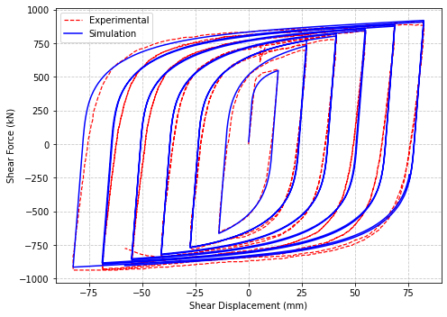

# P-V-M-interaction-in-Wide-flange-steel-section

This repository contains the implementation of a two-dimensional fiber section for OpenSees that captures the interaction among axial force (P), shear (V), and bending moment (M) in I-shaped rolled and built-up doubly symmteric steel cross-sections.
The formulation is based on the fiber section approach proposed by Saritas and Filippou (2009) [1], together with the simplified shear strain distribution proposed by Ding et al. (2018) [2].

The key features of this implementation are as follows:
- Supports multiaxial fibers and is compatible with forceBeamColumn elements.  
- Implements a constant shear strain distribution in the web and web-flange junction and another constant shear strain in the flanges, which is a function of web shear strain, cross-sectional geometry, link length, and ultimate material strength.
- Allows different material properties for the web and flange fibers.
  
---
## Input Syntax
To define a wide-flange steel section with this proposed fiber section, use the following command:

section WFSection2d $secTag $matTagWeb $d $tw $bf $tf $nfw $nff -nd_shear $link_length $fu $matTagFlange

| Argument           | Type    | Description                                                                  |
| ------------------ | ------- | ---------------------------------------------------------------------------- |
| `$secTag`          | Integer | Unique section tag identifier                                                     |
| `$matTagWeb`          | Integer | Material tag  assigned to the web fibers                                                |
| `$d`               | Float   | Overall section depth                                             |
| `$tw`              | Float   | Web thickness                                                               |
| `$bf`              | Float   | Flange width                                                               |
| `$tf`              | Float   | Flange thickness                                                           |
| `$nfw`    | Integer | Number of fibers along the web depth                                      |
| `$nff` | Integer | Number of fibers in each flange region                                      |
| `$link_length` | Float   | Length of the link member |
| `$fu` | Float   | Ultimate strength of the steel material |
| `$matTagFlange` | Float   | Material tag assigned to fibers of the flange (Optional) |

## Note:

-  `$matTagFlange` is optional. If it is not specified, `$matTagWeb` is used for the entire cross-section; that is, the same material is assigned to both the web and flange fibers.
- `$nff` must be an even number to properly represent the assumed shear strain distribution in the flange regions. If an odd value is specified, $nff is automatically increased by one internally.

## Example TCL input
```tcl
# ==============================================================================
# OpenSees TCL: Fiber Section for I-section to capture PVM interaction with GenPlasticity material
# Structural Model: EBF Shear Link under Cyclic Loading
# Units: kN, mm
# ==============================================================================

wipe; # Clear OpenSees model

# ------------------------------------------------------------------------------
# 1. Model & Node Definition
# ------------------------------------------------------------------------------
model basic -ndm 2 -ndf 3

set L 711.2; # Member length (mm)

# Nodes: node Tag X Y
node 1   0.0  0.0
node 2    $L  0.0

# Boundary Conditions: fix nodeTag UX UY RZ
fix 1 1 1 1  ; # Fully fixed base
fix 2 1 0 1  ; # Guided boundary: free along UY (DOF 2)

# ------------------------------------------------------------------------------
# 2. Material Definitions (Generalized Plasticity)
# ------------------------------------------------------------------------------
set nu 0.3
# --- Web Material Parameters ---
set matTagweb 1
set Eweb 131.492
set sigweb1 0.154
set Hisoweb 0.0217
set Hkinweb 0.4863
set Parameter_phi_web 0.1311
set Parameter_delta_web 15.9556
set sigweb2 0.069
set Parameter_phi_2_web 0.3232
set Parameter_delta_2_web 14.4847

nDMaterial GenPlasticity $matTagweb $Eweb $nu $sigweb1 $Hisoweb $Hkinweb \
                         $Parameter_delta_web $Parameter_phi_web \
                         $sigweb2 $Parameter_delta_2_web $Parameter_phi_2_web 

# ------------------------------------------------------------------------------
# 3. Section & Geometric Transformation Setup
# ------------------------------------------------------------------------------
set secTag 1
set d  454.15  ; # Total depth (mm)
set bf 152.00  ; # Flange width (mm)
set tf  13.23  ; # Flange thickness (mm)
set tw   7.98  ; # Web thickness (mm)

# Section definition (WFSection2d)
section WFSection2d $secTag $matTagweb $d $tw $bf $tf 10 5 -nd_shear $L 403.34 $matTagweb

# Geometric Transformation
set LTrans 1
geomTransf Linear $LTrans

# ------------------------------------------------------------------------------
# 4. Element Definition
# ------------------------------------------------------------------------------
set Np 6 ; # Number of Gauss-Lobatto integration points
element forceBeamColumn 1 1 2 $Np $secTag $LTrans -integration Lobatto

# ------------------------------------------------------------------------------
# 5. Recorders
# ------------------------------------------------------------------------------
recorder Node -file nodes_PVM.txt -node 2 -dof 1 2 3 disp
recorder Element -file Elm1F_PVM.txt -ele 1 force

# ------------------------------------------------------------------------------
# 6. Load Pattern & Analysis Setup
# ------------------------------------------------------------------------------
pattern Plain 2 Linear {
    load 2 0.0 1.0 0.0 ; # Apply unit transverse load at Node 2 (UY)
}

system SparseGeneral -piv
constraints Transformation
test NormDispIncr 1.0e-6 1000
algorithm Newton -initial
numberer RCM
analysis Static

# ------------------------------------------------------------------------------
# 7. Loading Protocol Execution (Same-Directory disp_history.dat)
# ------------------------------------------------------------------------------
set scriptDir [file dirname [file normalize [info script]]]
set datFile   [file join $scriptDir "disp_history.dat"]

if {![file exists $datFile]} {
    error "ERROR: Required displacement history file '$datFile' not found in current directory."
}

set fp [open $datFile r]
set currentDisp 0.0
set nodeTag 2
set dofTag 2

while {[gets $fp targetDisp] >= 0} {
    set targetDisp [string trim $targetDisp]
    if {$targetDisp ne ""} {
        set dU [expr {$targetDisp - $currentDisp}]
        if {abs($dU) > 1.0e-12} {
            integrator DisplacementControl $nodeTag $dofTag $dU
            set ok [analyze 1]
            if {$ok != 0} {
                puts "WARNING: Convergence failed at target displacement: $targetDisp mm"
                break
            }
            set currentDisp $targetDisp
        }
    }
}
close $fp

puts "Finished Analysis Successfully."
```

## Example Python input
```tcl
import os
import sys
import matplotlib.pyplot as plt
import numpy as np
import pandas as pd
import openseespy.opensees as ops

# ==============================================================================
# OpenSeesPy: Fiber Section for I-section to capture PVM interaction
# Structural Model: EBF Shear Link under Cyclic Loading
# Units: kN, mm
# ==============================================================================

ops.wipe()  # Clear OpenSees model

# ------------------------------------------------------------------------------
# 1. Model & Node Definition
# ------------------------------------------------------------------------------
ops.model('basic', '-ndm', 2, '-ndf', 3)

L = 711.2  # Member length (mm)

ops.node(1, 0.0, 0.0)
ops.node(2, L, 0.0)

ops.fix(1, 1, 1, 1)  # Fully fixed base
ops.fix(2, 1, 0, 1)  # Guided boundary: free along UY (DOF 2)

# ------------------------------------------------------------------------------
# 2. Material Definitions (Generalized Plasticity)
# ------------------------------------------------------------------------------
nu = 0.3

matTagweb = 1
Eweb = 131.492
sigweb1 = 0.154
Hisoweb = 0.0217
Hkinweb = 0.4863
Parameter_phi_web = 0.1311
Parameter_delta_web = 15.9556
sigweb2 = 0.069
Parameter_phi_2_web = 0.3232
Parameter_delta_2_web = 14.4847

ops.nDMaterial(
    'GenPlasticity', matTagweb, Eweb, nu, sigweb1, Hisoweb, Hkinweb,
    Parameter_delta_web, Parameter_phi_web, sigweb2,
    Parameter_delta_2_web, Parameter_phi_2_web
)

# ------------------------------------------------------------------------------
# 3. Section & Geometric Transformation Setup
# ------------------------------------------------------------------------------
secTag = 1
d = 454.15   # Total depth (mm)
bf = 152.00  # Flange width (mm)
tf = 13.23   # Flange thickness (mm)
tw = 7.98    # Web thickness (mm)

ops.section(
    'WFSection2d', secTag, matTagweb, d, tw, bf, tf, 10, 6,
    '-nd_shear', L, 403.34, matTagweb
)

LTrans = 1
ops.geomTransf('Linear', LTrans)

# ------------------------------------------------------------------------------
# 4. Integration Rule & Element Definition
# ------------------------------------------------------------------------------
integTag = 1
Np = 6  # Number of Gauss-Lobatto integration points

ops.beamIntegration('Lobatto', integTag, secTag, Np)
ops.element('forceBeamColumn', 1, 1, 2, LTrans, integTag)

# ------------------------------------------------------------------------------
# 5. Recorders
# ------------------------------------------------------------------------------
ops.recorder('Node', '-file', 'nodes_PVM.txt', '-node', 2, '-dof', 1, 2, 3, 'disp')
ops.recorder('Element', '-file', 'Elm1F_PVM.txt', '-ele', 1, 'force')

# ------------------------------------------------------------------------------
# 6. Load Pattern & Analysis Setup
# ------------------------------------------------------------------------------
ops.timeSeries('Linear', 1)
ops.pattern('Plain', 2, 1)
ops.load(2, 0.0, 1.0, 0.0)  # Apply unit transverse load at Node 2 (UY)

ops.system('SparseGeneral', '-piv')
ops.constraints('Transformation')
ops.test('NormDispIncr', 1.0e-6, 1000)
ops.algorithm('Newton', '-initial')
ops.numberer('RCM')

# ------------------------------------------------------------------------------
# 7. Loading Protocol Execution
# ------------------------------------------------------------------------------
script_dir = os.path.dirname(os.path.abspath(__file__))
dat_file = os.path.join(script_dir, "disp_history.dat")

if not os.path.exists(dat_file):
    raise FileNotFoundError(f"ERROR: Required displacement history file '{dat_file}' not found in current directory.")

current_disp = 0.0
node_tag = 2
dof_tag = 2
analysis_initialized = False

with open(dat_file, 'r') as fp:
    for line in fp:
        target_str = line.strip()
        if target_str:
            target_disp = float(target_str)
            dU = target_disp - current_disp
            if abs(dU) > 1.0e-12:
                ops.integrator('DisplacementControl', node_tag, dof_tag, dU)
                
                # Initialize analysis object after first integrator call
                if not analysis_initialized:
                    ops.analysis('Static')
                    analysis_initialized = True
                
                ok = ops.analyze(1)
                if ok != 0:
                    print(f"WARNING: Convergence failed at target displacement: {target_disp} mm")
                    break
                current_disp = target_disp

# Flush recorders to output text files
ops.wipe()
print("Finished OpenSeesPy Analysis Successfully.")

# ------------------------------------------------------------------------------
# 8. Plotting Numerical vs. Experimental Response
# ------------------------------------------------------------------------------
disp_data = np.loadtxt('nodes_PVM.txt')
force_data = np.loadtxt('Elm1F_PVM.txt')

num_disp = disp_data[:, 1]     # Column 2 (Node 2 UY displacement in mm)
num_force = force_data[:, 4]    # Column 5 (Element Shear Force V_y in kN)

plt.figure(figsize=(7, 5))

# Robust loading of experimental data
exp_file_csv = os.path.join(script_dir, "ebf-shear-link-angle-18.csv")
exp_file_raw = os.path.join(script_dir, "ebf-shear-link-angle-18")

exp_loaded = False

for efile in [exp_file_csv, exp_file_raw]:
    if os.path.exists(efile):
        try:
            # Read file handling headers/comments
            exp_df = pd.read_csv(efile, header=None, comment='%', sep=r'\s+|,', engine='python')
            
            # Convert columns strictly to numeric float values
            raw_angle = pd.to_numeric(exp_df.iloc[:, 0], errors='coerce').dropna().values
            raw_force = pd.to_numeric(exp_df.iloc[:, 1], errors='coerce').dropna().values
            
            # Match lengths after cleaning NaN entries
            min_len = min(len(raw_angle), len(raw_force))
            exp_disp = raw_angle[:min_len] * L
            exp_force = raw_force[:min_len]
            
            plt.plot(exp_disp, exp_force, color='red', linestyle='--', linewidth=1.2, label='Experimental')
            exp_loaded = True
            break
        except Exception as e:
            print(f"Could not parse experimental file {efile}: {e}")

if not exp_loaded:
    print("Notice: Experimental file not loaded or not found. Plotting numerical response only.")

# Plot OpenSeesPy Response
plt.plot(num_disp, num_force, color='blue', linewidth=1.5, label='Simulation')

#plt.title("EBF Link Response: Numerical vs. Experimental")
plt.xlabel("Shear Displacement (mm)")
plt.ylabel("Shear Force (kN)")
plt.legend(loc='best')
plt.grid(True, linestyle='--', alpha=0.7)
plt.tight_layout()
plt.show()
```

<p align="center">
  <br>
  <em>Figure 2 : Response generated by sample code
    </em>
</p>

Code implementation and image development by Ms. Sukanya Karmakar (sukanyak21@iitk.ac.in), IIT Kanpur  

## Reference
[1] Afsin Saritas and Filip C. Filippou. Frame Element for Metallic Shear-Yielding Members under Cyclic Loading. Journal of Structural Engineering, 135(9):1115–1123, September 2009. ISSN 0733-9445, 1943-541X.  URL https://ascelibrary.org/doi/10.1061/%28ASCE%29ST.1943-541X.0000041.

[2] Ding, R., Nie, X. and Tao, M.-X. (2018), ‘Fiber beam–column element considering flange contribution for steel links under cyclic loads’, Journal of Structural Engineering 144(9), 04018131.

---
